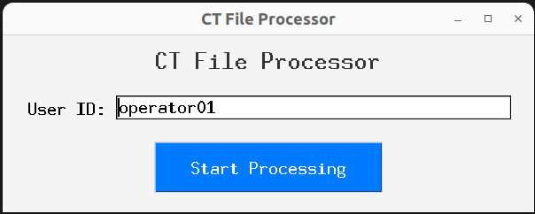
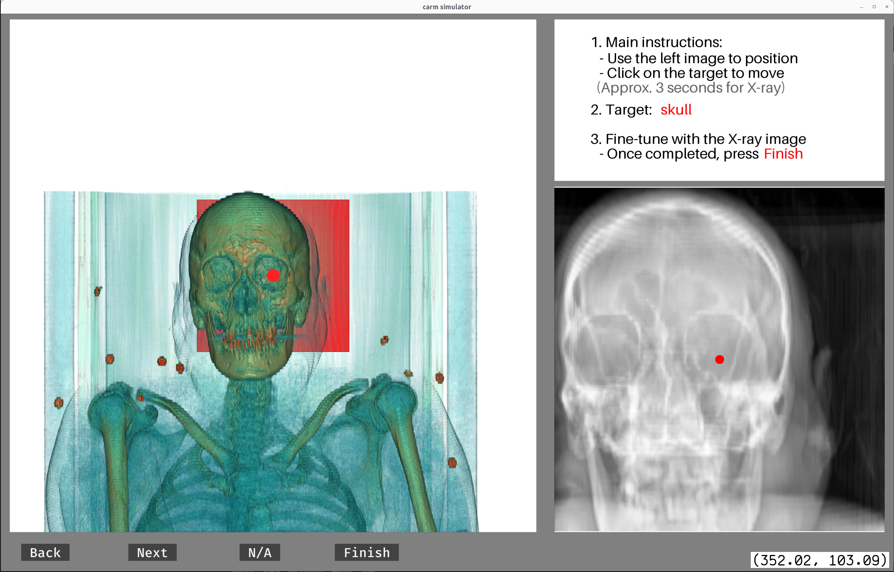

# UVMMC C-ARM Automation GUI

This GUI facilitates the acquisition of CT coordinates for the target areas (arch, head, neck) to train the Deep Learning Model.

## Table of Contents

- [Getting Started](#getting-started)
  - [Prerequisites](#prerequisites)
  - [Installation](#installation)
- [Usage](#usage)

## Getting Started

### Prerequisites

1. NVIDIA GPU with > 11 GB is preferred, but the program has been tested with 8 GB.
2. An Ubuntu environment is strongly recommended (Windows is also supported).
3. The code is written in Python 3.9.

### Installation

Clone the repository:

```bash
git clone https://github.com/AhmadArrabi/C_arm_guidance.git
cd C-arm-guidance/annotation_GUI
```

Set up the Conda environment:

```bash
conda create env -f environment.yml
```

## Usage 

Before using this program, ensure the directory containing the CT scans is correctly specified.

To run the GUI, use the following command:

```bash
python3 select_image_gui.py ./
```



1. Click on `Submit` to check for compatible files in the directory.
2. Choose the NIfTI file you want to simulate.
3. Press the `Execute Command` button.



Tasks are defined in the `ct_viewer_gui.py` file. There are 20 landmarks to annotate.

### Operation Instructions

- Click on the left view to generate an X-ray image using <a href="https://github.com/arcadelab/deepdrr">DeepDRR</a>.
- Fine-tune the image by clicking the left button on the right-bottom image.
- When done annotating a landmark, press `Next`.
- If a landmark is not visible, press `NA`.
- To return to the previous landmark, press `Back`.
- After completing all 20 annotations, press `Finish`. The next patient in the folder will automatically load.
